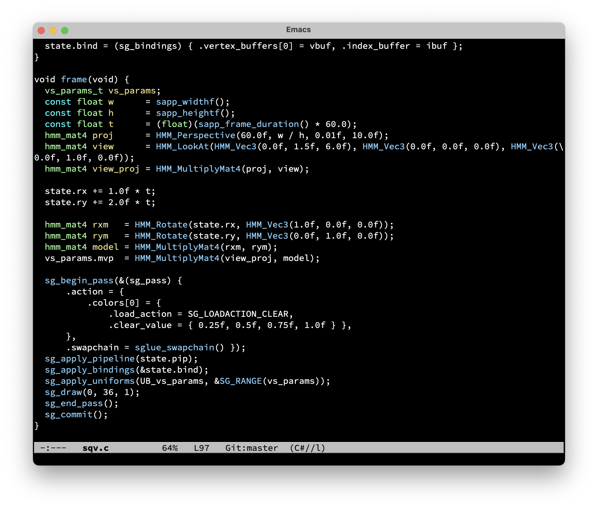

# emacs-default-black-theme
a cleaned up version of default black theme based on @magnars

original source code [here](https://github.com/magnars/.emacs.d/blob/master/themes/default-black-theme.el)

